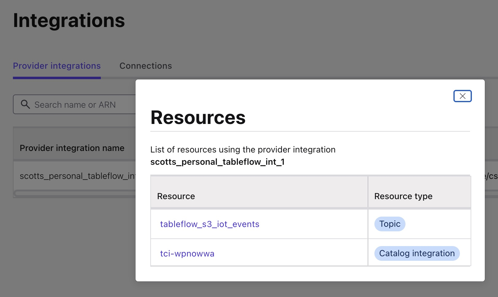

# Tableflow Using External S3 Storage and AWS Glue in Confluent Cloud

<br>

# Overview

This is a bit of a play on [Tableflow Quick Start Using Your Storage and AWS Glue in Confluent Cloud](https://docs.confluent.io/cloud/current/topics/tableflow/get-started/quick-start-custom-storage-glue.html)

It's a great exercise for exposing Confluent Cloud kafka topics as Iceberg tables, but with a tweak.

If you want to just follow the website verbatim, that's fine. Otherwise, continue on reading:
- instead lieu of the confluent datagen connector, mock data comes from a python producer to mimick IoT data
- the use of a data contract is required so the datagen program creates an AVRO schema
- this repo leverage the Confluent CLI
- some additional explanation, particulary on Step 4

If you get stuck, remember in the Confluent Cloud UI is the Confluent AI Assistant. It can not only answer questions, but generate code for you!

In the link above regadring the original hands-on example from Confluent, there are 5 steps:
Step 1: Create a topic and publish data
Step 2: Configure your S3 bucket and provider integration
Step 3: Enable Tableflow on your topic
Step 4: Configure AWS Glue Catalog integration
Step 5: Query Iceberg tables

In this repo, the only thing you are changing is Step 1. So let's do that.

<br>

# Steps

## Step 1. Create a topic and publish data

Edit your [`.env`](./.env) file with your credentials.

Then run the init script:

```bash
./services_setup_all.sh
```

📄 View the script: [`services_setup_all.sh`](./services_setup_all.sh)

Execute a sample user input query:

```bash
python mock_iot_events_generator.py
```

📄 View the program: [`mock_iot_events_generator.py`](./mock_iot_events_generator.py)

<br>

## Step 2

Follow these instructions carefully before you enable Tableflow on your topic.

It requires a bit of bouncing around in between AWS and Confluent Cloud so don't miss a step.

When this is complete you should have in AWS:
- S3 Bucket(s)
- IAM Policy
- IAM Role
- Confluent Tableflow Integration

Your IAM Role trust relationships (trust policy) will look something like this in addition to having your new IAM policy attached:

```json
{
    "Version": "2012-10-17",
    "Statement": [
        {
            "Effect": "Allow",
            "Principal": {
                "AWS": "<provided from confluent setup>"
            },
            "Action": "sts:AssumeRole",
            "Condition": {
                "StringEquals": {
                    "sts:ExternalId": "<provided from confluent setup>"
                }
            }
        },
        {
            "Effect": "Allow",
            "Principal": {
                "AWS": "<provided from confluent setup>"
            },
            "Action": "sts:TagSession"
        }
    ]
}
```

Your IAM Policy will look something like this:

```json
{
    "Version": "2012-10-17",
    "Statement": [
        {
            "Effect": "Allow",
            "Action": [
                "s3:GetBucketLocation",
                "s3:ListBucketMultipartUploads",
                "s3:ListBucket"
            ],
            "Resource": [
                "arn:aws:s3:::<your S3 bucket>"
            ]
        },
        {
            "Effect": "Allow",
            "Action": [
                "s3:PutObject",
                "s3:PutObjectTagging",
                "s3:GetObject",
                "s3:DeleteObject",
                "s3:AbortMultipartUpload",
                "s3:ListMultipartUploadParts"
            ],
            "Resource": [
                "arn:aws:s3:::<your S3 bucket>/*"
            ]
        }
    ]
}
```


And in Confluent Cloud, your integration should look something like this:

<table>
  <tr>
    <td>
      <strong>`integration`</strong><br>
      <a href="./screenshot3.jpg" target="_blank">
        
      </a>
    </td>
  </tr>
</table>

<br>

## Step 3

Step 3 should be pretty easy. Once you get Tableflow enabled, you should see a few healthy signs in addition to data in your S3 bucket!

<table>
  <tr>
    <td>
      <strong>`kafka topic output`</strong><br>
      <a href="./screenshot2.jpg" target="_blank">
        
      </a>
    </td>
    <td>
      <strong>`S3 bucket`</strong><br>
      <a href="./screenshot1.jpg" target="_blank">
        
      </a>
    </td>
  </tr>
</table>

<br>

## Step 4

A note about Step 4. The instructions say this: "Follow the steps in Integrate Tableflow with the AWS Glue Catalog to configure AWS Glue Data Catalog as a catalog integration."

Here's a bit more about that. You can do whatever you want, but here's what I did for ease of testing in this exercise.

At the cluster level:
- click on Tableflow and create an External Catalog Integrations using the instructions on the page. 
- During that setup, I chose to link it to my existing AWS provider integration that I setup earlier in Step 2.
- After creating the integration, don't worry if the status says disconnected. The error may say something like insufficient permissions.

Next, at the environment level:
- Click on Add Integration.
- I chose Existing Role because I am going to add this new trust policy to my existing role. 
- I took this trust policy JSON and created a new IAM policy in AWS and attached it to my existing IAM role and continued on to create the integration.

Your new glue policy will look something like this:

```json
{
    "Version": "2012-10-17",
    "Statement": [
        {
            "Effect": "Allow",
            "Action": [
                "glue:GetTable",
                "glue:GetDatabase",
                "glue:DeleteTable",
                "glue:DeleteDatabase",
                "glue:CreateTable",
                "glue:CreateDatabase",
                "glue:UpdateTable",
                "glue:UpdateDatabase"
            ],
            "Resource": [
                "arn:aws:glue:<your AWS region>:<your AWS account ID>>:*"
            ]
        }
    ]
}
```

<table>
  <tr>
    <td>
      <strong>`AWS Glue Integration`</strong><br>
      <a href="./screenshot13.jpg" target="_blank">
        
      </a>
    </td>
    <td>
      <strong>`AWS Glue policy (attached to existing role)`</strong><br>
      <a href="./screenshot4.jpg" target="_blank">
        
      </a>
    </td>
  </tr>
</table>

<table>
  <tr>
    <td>
      <strong>`AWS Glue Integration`</strong><br>
      <a href="./screenshot12.jpg" target="_blank">
        
      </a>
    </td>
  </tr>
</table>

Finally, I went back to the Tableflow navigation at the cluster level and clicked on Start on my new integration and it worked.

<table>
  <tr>
    <td>
      <strong>`AWS Glue Integration`</strong><br>
      <a href="./screenshot10.jpg" target="_blank">
        
      </a>
    </td>
  </tr>
</table>

I can see the Glue Data Catalog contains my data now!

<table>
  <tr>
    <td>
      <strong>`AWS Glue Data Catalog`</strong><br>
      <a href="./screenshot5.jpg" target="_blank">
        
      </a>
    </td>
  </tr>
</table>

<br>

## Step 5

If everything goes right, you should also now be able to view your tables and query them!

Note: to use the Athena query tool you have to place the output results somewhere - I created a new S3 bucket to hold it.

<table>
  <tr>
    <td>
      <strong>`S3 Athena output bucket`</strong><br>
      <a href="./screenshot8.jpg" target="_blank">
        
      </a>
    </td>
  </tr>
  <tr>
    <td>
      <strong>`S3 Athena query console`</strong><br>
      <a href="./screenshot6.jpg" target="_blank">
        
      </a>
    </td>
  </tr>
  <tr>
    <td>
      <strong>`S3 Athena bucket query output results`</strong><br>
      <a href="./screenshot7.jpg" target="_blank">
        
      </a>
    </td>
  </tr>
</table>

<br>

## Final thoughts

This is really cool. It worked as expected. Kafka topics exposed as Icerberg tables!

Just remember clean up your AWS and Confluent Cloud environments so you do not get charged.